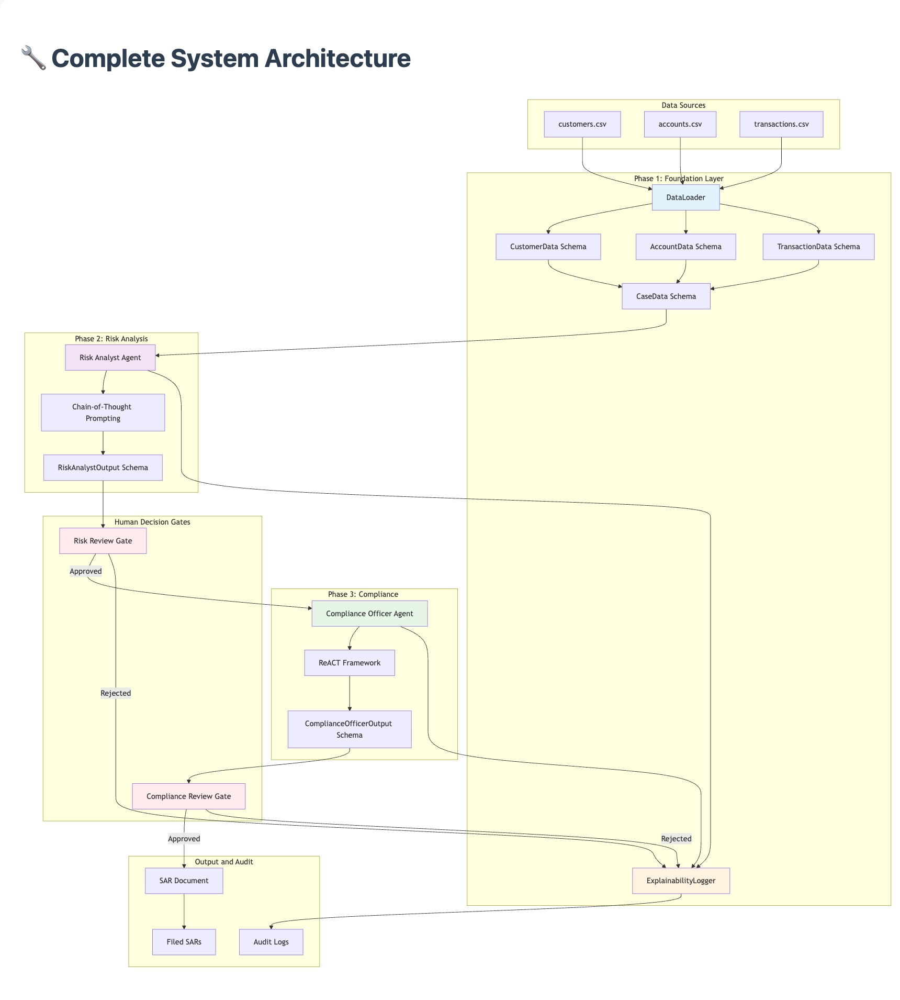

# SAR Processing System

An exploration of multi-agent AI applied to financial crime compliance. This project automates the detection and reporting of suspicious financial activity using two cooperating AI agents, a human-in-the-loop decision gate, and a full audit trail — built entirely in Python with synthetic data.

The core question driving this build: **can a well-designed multi-agent system handle the reasoning and documentation demands of a regulated compliance workflow, end to end?**

---

## What It Does

Financial institutions are legally required to file Suspicious Activity Reports (SARs) with FinCEN within 30 days of detecting suspicious activity. In practice, this process is slow, manual, and inconsistent. This system automates the two hardest parts — risk classification and narrative generation — while keeping a human reviewer in the decision loop before anything gets filed.

The pipeline:

```
CSV Data → DataLoader → CaseData → Risk Analyst Agent → Human Review Gate
                                                      → Compliance Officer Agent → SAR Document + Audit Log
```

---

## System Architecture



The foundation layer (`foundation_sar.py`) defines the Pydantic schemas that flow through the entire system — `CustomerData`, `AccountData`, `TransactionData` are aggregated by `DataLoader` into a single `CaseData` object. Every downstream component works from that unified case representation.

---

## The Agents

### Risk Analyst Agent — Chain-of-Thought Reasoning

The first agent receives a `CaseData` object and classifies the suspicious activity into one of five categories: `Structuring`, `Sanctions`, `Fraud`, `Money_Laundering`, or `Other`.

It uses **Chain-of-Thought prompting** — the model is instructed to reason step-by-step through the customer profile, transaction patterns, account behaviour, and regulatory indicators before committing to a classification. This makes the reasoning traceable and auditable, not just a label.

Output is a validated `RiskAnalystOutput` containing the classification, a confidence score, risk level (`Low`, `Medium`, `High`, or `Critical` — Critical is reserved for severe Sanctions violations and complex Money Laundering schemes), key indicators, and the full reasoning chain.

### Compliance Officer Agent — ReACT Framework

The second agent only runs if the human reviewer approves the risk finding. It takes the `CaseData` and `RiskAnalystOutput` and generates a FinCEN-ready SAR narrative using the **ReACT (Reasoning + Action) framework** — explicitly separating the reasoning phase (what regulatory context applies, what details are material) from the action phase (drafting the narrative).

The narrative is constrained to 120 words, must include regulatory citations (BSA/AML), and is validated against a `ComplianceOfficerOutput` schema before being accepted.

---

## Human-in-the-Loop

The human review gate sits between the two agents deliberately. The Risk Analyst's findings — classification, confidence score, risk level, and reasoning — are surfaced to a reviewer before the Compliance Officer is ever invoked. A reviewer can approve (triggering narrative generation and SAR filing) or reject (closing the case with an audit entry).

This is not just a UX choice. In a regulated environment, AI-generated compliance documents require human sign-off. The gate enforces that contractually, not just as a best practice.

### Cost Savings Through Human Gating

The placement of the human gate has a direct and measurable impact on API cost. The Compliance Officer (Stage 2) is the more expensive call — it receives a longer prompt (the full risk analysis plus transaction history), generates a structured 120-word narrative, and performs regulatory validation. Running it on every case, regardless of outcome, wastes spend on cases a reviewer would reject anyway.

By requiring human approval before Stage 2 is invoked:

- **Rejected cases cost only one API call** (the Stage 1 risk analysis), not two.
- **The savings scale with rejection rate.** If a reviewer rejects 20% of cases, 20% of Stage 2 calls are eliminated. At higher alert volumes — thousands of cases per month — this compounds significantly.
- **Cost is tracked from real token usage**, not estimates. After each run, `workflow_metrics_report.json` records the actual `prompt_tokens` and `completion_tokens` returned by the API for each stage, computes the dollar cost using the model's per-million-token pricing, and calculates what the same run would have cost if Stage 2 had been invoked on all cases. The difference is the measurable saving the gate produced.

In the test runs on five cases with one rejection, the gate eliminated one Stage 2 call entirely. At scale, the same pattern applied to thousands of monthly cases produces material cost reduction — while simultaneously ensuring no SAR narrative is generated without explicit reviewer approval.

### Cost Projections at Scale (1,000 cases/month)

Based on actual token usage from live API calls (GPT-4, $30/M input · $60/M output):

| | Cost |
|---|---|
| Stage 1 per case (risk analysis) | ~$0.138 |
| Stage 2 per case (compliance narrative) | ~$0.106 |

**At 20% rejection rate** (200 cases skipped, 800 proceed to Stage 2):

| | Monthly Cost |
|---|---|
| Stage 1 × 1,000 | $138.29 |
| Stage 2 × 800 | $84.86 |
| **Two-stage total** | **$223.15** |
| Single-stage (no gate) | $244.36 |
| **Monthly saving** | **~$21** |

At 50% rejection the saving grows to ~$53/month. The gate pays off proportionally to how aggressively reviewers filter — and every rejected case also avoids generating a compliance narrative that would never be filed.

---

## Audit Trail

Every agent action — successful or failed — is logged by `ExplainabilityLogger` to an append-only JSONL file. Each entry captures the agent type, action, case ID, input summary, output summary, the agent's reasoning, execution time, and success status.

Human reviewer decisions are also persisted to the same audit log via `log_human_decision()` — each approval or rejection is written with a UTC timestamp, case ID, the reviewer's input, and the AI classification and confidence that informed the decision. Nothing in the log is ever overwritten.

This produces an audit trail that can be examined by regulators, surfaced in Log Analytics, or replayed to reconstruct any decision.

---

## Project Structure

```
SAR_system/
├── src/
│   ├── foundation_sar.py           # Pydantic schemas, DataLoader, ExplainabilityLogger
│   ├── risk_analyst_agent.py       # Risk Analyst with Chain-of-Thought prompting
│   └── compliance_officer_agent.py # Compliance Officer with ReACT prompting
├── notebooks/
│   ├── 01_data_exploration.ipynb   # Data profiling and schema design
│   ├── 02_agent_development.ipynb  # Agent prompt engineering and testing
│   └── 03_workflow_integration.ipynb # End-to-end workflow and integration tests
├── tests/
│   ├── test_foundation.py          # 10 tests — schemas, DataLoader, logger
│   ├── test_risk_analyst.py        # 10 tests — CoT analysis, JSON parsing, error handling
│   └── test_compliance_officer.py  # 10 tests — ReACT narratives, validation, citations
├── data/
│   ├── customers.csv               # 150 synthetic customers with risk ratings
│   ├── accounts.csv                # 178 accounts across 4 types
│   └── transactions.csv            # 4,268 transactions with suspicious patterns
├── outputs/
│   ├── filed_sars/                 # Generated SAR JSON documents
│   ├── audit_logs/                 # JSONL decision audit trails (agents + human reviewer)
│   └── workflow_metrics_report.json # Per-run performance report (timing, tokens, cost savings)
└── assets/
    └── architecture.png            # System architecture diagram
```

---

## Getting Started

### Requirements

- Python 3.8+
- An OpenAI-compatible API key

```bash
pip install -r requirements.txt
```

### Environment

```bash
cp .env.template .env
# Add your OPENAI_API_KEY to .env
```

### Running Tests

```bash
# Full test suite (30 tests)
python -m pytest tests/ -v

# Individual modules
python -m pytest tests/test_foundation.py -v
python -m pytest tests/test_risk_analyst.py -v
python -m pytest tests/test_compliance_officer.py -v
```

All 30 tests pass. Agent tests use mocked OpenAI responses — no API key needed to run the test suite.

---

## What's in the Data

The synthetic dataset is designed to contain realistic suspicious patterns:

- **Structuring** — repeated sub-threshold deposits to avoid CTR filing requirements
- **Money Laundering** — layered transactions obscuring the origin of funds
- **Sanctions** — transactions involving flagged counterparties or jurisdictions
- **Fraud** — irregular velocity and amount patterns inconsistent with customer profile

150 customers, 178 accounts, 4,268 transactions.

---

## Phase 2: Azure Production Deployment

The local prototype validates the agent design. The next phase moves this to Azure with production-grade infrastructure, replacing the notebook workflow and mocked API calls with managed, scalable services.

### Core Shift: Azure AI Foundry + Semantic Kernel

The agents will be rebuilt using **Semantic Kernel** as the agent framework, deployed and managed through **Azure AI Foundry**. Semantic Kernel's Process Framework handles the stateful two-stage workflow natively — including the async human approval gate — replacing the current `input()` pattern with a proper event-driven step.

**Azure AI Foundry** provides model deployment (Azure OpenAI GPT-4o), prompt versioning, built-in tracing to replace `ExplainabilityLogger`, and evaluation pipelines to continuously validate classification accuracy and narrative quality.

### Infrastructure

| Component | Azure Service |
|---|---|
| Agent framework | Semantic Kernel + Azure AI Foundry Agent Service |
| LLM | Azure OpenAI (GPT-4o) via Foundry deployment |
| Workflow orchestration | SK Process Framework (Durable Functions for scale) |
| Human review notifications | Azure Logic Apps → Teams/email |
| Customer/transaction data | Azure SQL Database |
| SAR document storage | Azure Blob Storage |
| Audit trail | Azure Cosmos DB + Log Analytics |
| Secrets management | Azure Key Vault + Managed Identity |
| Observability | Application Insights + Foundry Tracing |

### What Changes, What Stays

The prompting strategies (Chain-of-Thought, ReACT), Pydantic schemas, and the two-agent architecture carry forward unchanged. Semantic Kernel wraps the existing agent logic as `ChatCompletionAgent` definitions with plugins. The human gate becomes an async Foundry/SK process step waiting on an external approval event rather than a blocking `input()` call.

The synthetic dataset continues through Phase 2 — the goal is validating the cloud architecture, not production data.

---

## Key Design Decisions

**Two-stage processing** — Running the Compliance Officer only on approved cases avoids unnecessary LLM calls. Cost is computed from actual token usage returned by the API (`prompt_tokens / 1M × $30 + completion_tokens / 1M × $60` for GPT-4), and a durable JSON report is saved after every run with total tokens, per-stage timing, throughput, and the dollar savings from skipping Stage 2 on rejected cases.

**Structured output with Pydantic validation** — Both agents return validated schema objects, not raw strings. This makes downstream processing reliable and testable without defensive parsing at every step.

**Separation of reasoning and action** — CoT for risk classification, ReACT for narrative generation. The prompting strategy matches the task: open-ended pattern recognition vs. structured document production.

**Append-only audit logging** — Every decision, including rejections and failures, is logged. Nothing is overwritten. This is a regulatory requirement, not an implementation detail.
